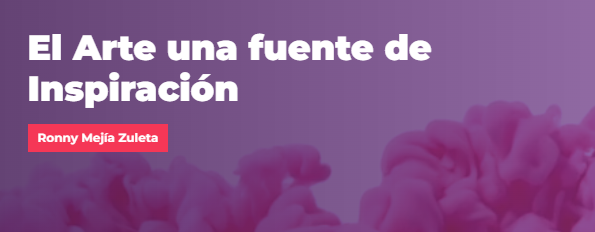
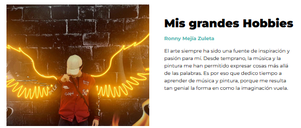
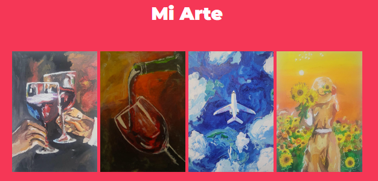
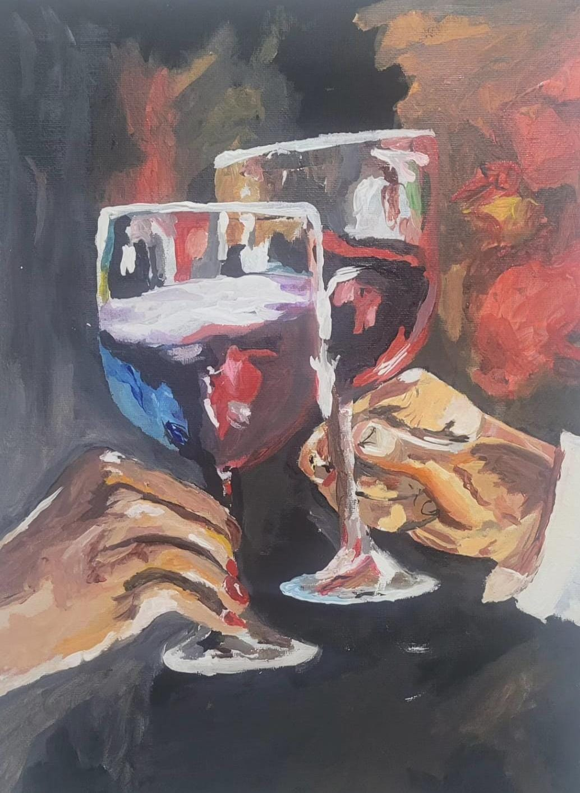
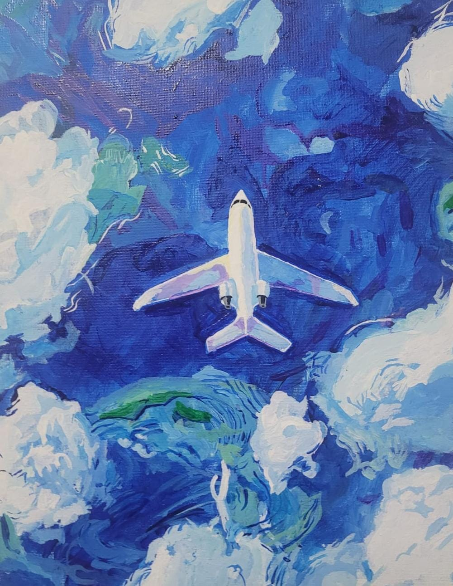
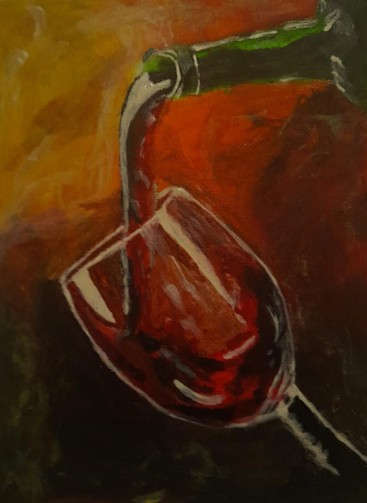
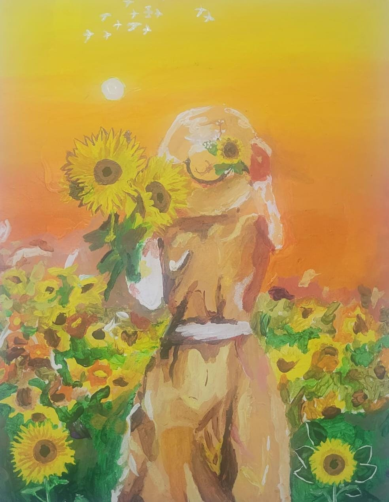

# Hobbies

En esta página muestro cómo el arte ha sido un gran influyente en mi vida y cómo me ha inspirado a crear mi propio arte.

## El Arte una fuente de Inspiración

### Ronny Mejía Zuleta

El arte siempre ha sido una fuente de inspiración y pasión en mi vida. Desde temprana edad, la música y la pintura me han permitido expresar cosas más allá de las palabras. Este sitio web está dedicado a mostrar algunas de mis obras y compartir la alegría que siento al crear.

## Mis Grandes Hobbies

El arte, en sus diversas formas, ocupa un lugar especial en mi vida. Me encanta experimentar con diferentes medios y técnicas para capturar la esencia de mis pensamientos y emociones.

## Mi Arte

Esta sección muestra mis obras de arte, cada una explorando diversos temas y técnicas artísticas.

Descripción de las Obras:
Copa de Vino: Una vibrante pintura que captura la celebración y disfrute con colores vivos y pinceladas expresivas.

Botella y Copa de Vino: Imagen evocadora de una botella vertiendo vino, transmitiendo calidez y la belleza de lo cotidiano con tonos cálidos.

Avión en el Cielo: Presenta un avión volando en un cielo despejado, creando una sensación de serenidad y libertad.

Niña con Girasoles: Muestra a una niña con girasoles en un campo florido, transmitiendo felicidad y una conexión con la naturaleza.

Cada obra refleja mi pasión por capturar momentos y emociones a través del arte, utilizando diversas técnicas y estilos para expresar su visión única.

---

Ronny Mejía Zuleta. Todos los derechos reservados.

