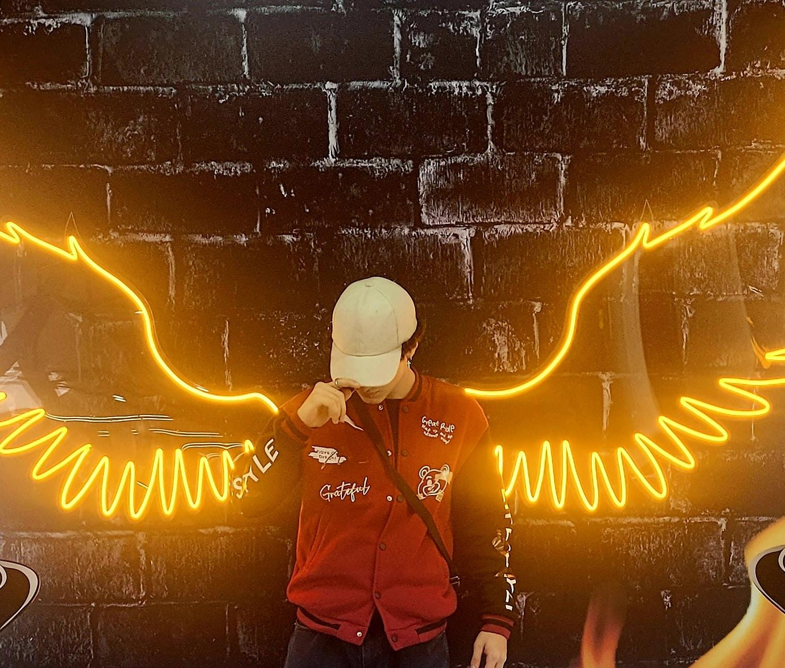
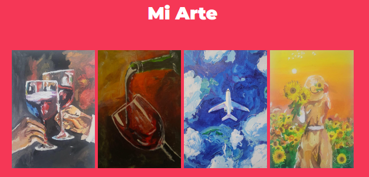

# Hobbies

En esta página muestro cómo el arte ha sido un gran influyente en mi vida y cómo me ha inspirado a crear mi propio arte.

## El Arte una fuente de Inspiración

### Ronny Mejía Zuleta

El arte siempre ha sido una fuente de inspiración y pasión en mi vida. Desde temprana edad, la música y la pintura me han permitido expresar cosas más allá de las palabras. Este sitio web está dedicado a mostrar algunas de mis obras y compartir la alegría que siento al crear.

## Mis Grandes Hobbies

El arte, en sus diversas formas, ocupa un lugar especial en mi vida. Me encanta experimentar con diferentes medios y técnicas para capturar la esencia de mis pensamientos y emociones.

## Mi Arte

---

Ronny Mejía Zuleta. Todos los derechos reservados.

